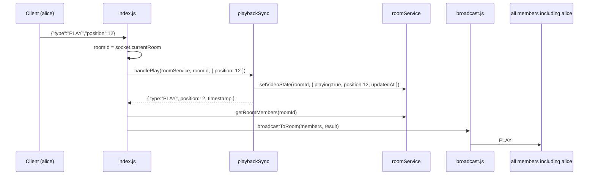
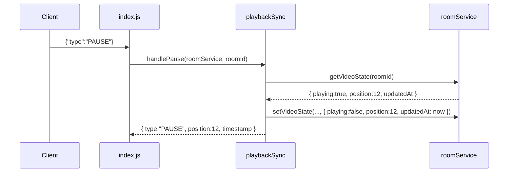
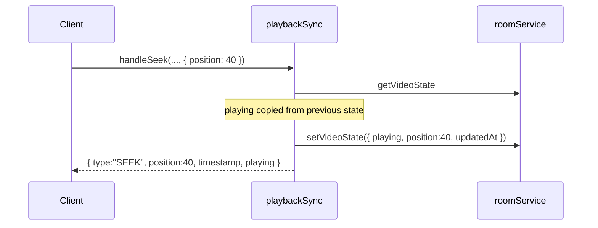
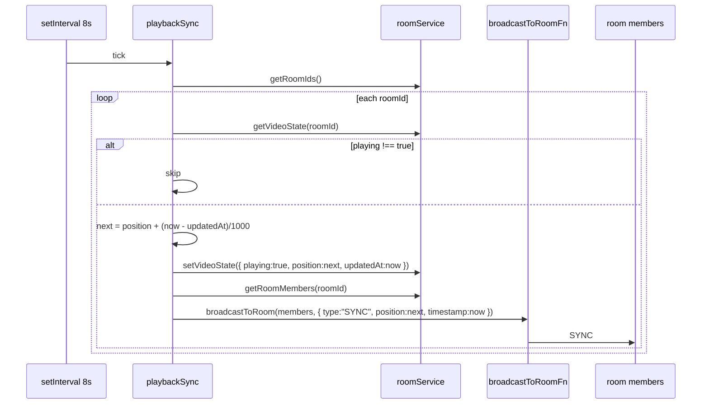

# Execution Map: Timestamped PLAY / PAUSE / SEEK / SYNC

Builds on the room-service refactor. Do not rename or restructure `roomService.js` / `broadcast.js` / `index.js` except as required to add this feature.

**Prerequisite:** [`docs/room-service-refactor-execution-map.md`](./room-service-refactor-execution-map.md) is implemented. This map’s baseline is that target, not today’s still-monolithic `server/index.js`.

---

## 0. Goal

Add server-side playback synchronization for a watch-party room. The server is the source of truth for `{ playing, position, updatedAt }`. Clients later do drift correction — not this task.

```
server/
├── index.js          # transport: dispatch PLAY/PAUSE/SEEK, start the SYNC timer
├── roomService.js    # add getVideoState / setVideoState; real videoState default
├── broadcast.js      # UNCHANGED
└── playbackSync.js   # NEW: build payloads, write videoState, periodic SYNC
```

`playbackSync.js` knows message shapes. `roomService.js` still does not. `index.js` dispatches and broadcasts; it does not compute positions.

---

## 1. Non-goals (do not do these)

- Do not implement client-side `computeExpectedPosition` / nudge / seek logic in `test-client.js` or `client/test.html` (except a **temporary** way to fire one PLAY for verification — see §10).
- Do not add AWS, Lambda, DynamoDB, or a new auth system.
- Do not change `claimToken` / `releaseToken` / `joinRoom` / `leaveRoom` membership behavior.
- Do not change `{ type: 'join-room' | 'user-joined' | 'user-left' }` shapes.
- Do not put PLAY/PAUSE/SEEK/SYNC payload construction in `index.js`.
- Do not `require('ws')` from `playbackSync.js` or `roomService.js`.
- Do not introduce extra npm packages. Keep CommonJS.

---

## 2. Baseline inventory (after room-service refactor)

| Piece | Assumed API | This task |
|---|---|---|
| `roomService.claimToken / releaseToken / joinRoom / leaveRoom / getRoomMembers` | unchanged contracts | do not change behavior |
| `RoomState.videoState` | placeholder `null` | replace with real object on room create |
| `broadcastToRoom(members, payload, excludeSocket)` | send to each OPEN member except exclude | unchanged; call with `excludeSocket` omitted/undefined for playback |
| `index.js` `'join-room'` + `'close'` | parse JSON, call roomService, broadcast join/leave | add PLAY/PAUSE/SEEK cases + start SYNC interval |
| Incoming message convention **today** | `{ type: 'join-room', roomId }` — **flat, no `payload` wrapper** | see Decision A — do not silently invent `{ payload: {...} }` |

There is no existing PLAY/PAUSE/SEEK traffic. `test-client.js` only sends `join-room` on `open`.

---

## 3. Data model

### RoomState after this task

```
RoomState = {
  members: Set<socket>,
  videoState: { playing: boolean, position: number, updatedAt: number }
}
```

Default when a room is **created** (inside existing `joinRoom` factory, membership logic otherwise untouched):

```
{ playing: false, position: 0, updatedAt: Date.now() }
```

| Field | Meaning |
|---|---|
| `playing` | `true` after PLAY, `false` after PAUSE; SEEK leaves it as-is |
| `position` | media position **in seconds** at `updatedAt` (see Decision E) |
| `updatedAt` | `Date.now()` ms epoch of that position snapshot |

`getVideoState(roomId)` returns that object or `undefined` (unknown room).
`setVideoState(roomId, videoState)` writes it onto the existing `RoomState` and does nothing if the room is missing. It never creates a room. It never broadcasts.

---

## 4. Module contracts

### 4.1 `roomService.js` additions

Keep every existing export’s behavior.

Add:

| Function | Args | Return | Notes |
|---|---|---|---|
| `getVideoState` | `(roomId)` | `videoState \| undefined` | `rooms.get(roomId)?.videoState` |
| `setVideoState` | `(roomId, videoState)` | `void` | assign onto existing room only |
| `getRoomIds` | `()` | `string[]` | **extra — see Decision C** |

Room create path in `joinRoom` — **only** the `videoState` initial value changes from `null` to the default object.

Must still not: `require('ws')`, `.send()`, `.readyState` (beyond existing claimToken leak), or build `{ type: 'PLAY' }` payloads.

### 4.2 `playbackSync.js` (new)

No `require('./roomService')`. No `require('./broadcast')`. No `require('ws')`. Callers inject `roomService` and, for the timer, `broadcastToRoomFn`.

| Function | Args | Side effect | Return (broadcast payload) |
|---|---|---|---|
| `handlePlay` | `(roomService, roomId, { position })` | `setVideoState({ playing: true, position, updatedAt: Date.now() })` | `{ type: 'PLAY', position, timestamp }` where `timestamp === updatedAt` |
| `handlePause` | `(roomService, roomId)` | `playing: false`, `position` from **last known** `getVideoState`, new `updatedAt` | `{ type: 'PAUSE', position, timestamp }` |
| `handleSeek` | `(roomService, roomId, { position })` | keep current `playing`, new `position` + `updatedAt` | `{ type: 'SEEK', position, timestamp, playing }` |
| `startSyncInterval` | `(roomService, broadcastToRoomFn, intervalMs = 8000)` | `setInterval` tick over playing rooms | interval handle (`clearInterval`-able) |

`handlePause` / `handleSeek` with a missing room or missing `videoState`: return `null` and do not write. `index.js` skips broadcast when the result is `null`.

**SYNC tick (each interval):**

```
now = Date.now()
for roomId of roomService.getRoomIds()
  state = roomService.getVideoState(roomId)
  if !state or state.playing !== true
    continue
  elapsedSec = (now - state.updatedAt) / 1000
  nextPosition = state.position + elapsedSec
  roomService.setVideoState(roomId, {
    playing: true,
    position: nextPosition,          # Decision F — must persist, not only updatedAt
    updatedAt: now
  })
  broadcastToRoomFn(
    roomService.getRoomMembers(roomId),
    { type: 'SYNC', position: nextPosition, timestamp: now }
    # no excludeSocket → every member including everyone in the room
  )
```

`broadcastToRoomFn` is the existing `broadcastToRoom(members, payload, excludeSocket)` — pass members, not a roomId.

### 4.3 `index.js` changes

- `require('./playbackSync')` (or destructure the four functions).
- After `httpServer.listen(...)`,  
  `const syncHandle = playbackSync.startSyncInterval(roomService, broadcastToRoom, 8000)`  
  Store `syncHandle`. Do not have to wire `SIGINT` unless shutdown already exists (it does not).
- In the `'message'` handler, next to `'join-room'`, dispatch `'PLAY' | 'PAUSE' | 'SEEK'`.
- `index.js` does **not** invent timestamps or recompute position.

Join/leave broadcasts stay **excluding** the sender. Playback broadcasts use Decision B.

### 4.4 `broadcast.js`

No changes.

---

## 5. Decisions (resolve before typing)

These are the places the task said not to guess silently. Recommendations are included so implementation can proceed once you confirm.

### Decision A — incoming message shape  **FLAG / confirm**

Existing convention is **flat**:

```js
{ type: 'join-room', roomId }
```

There is no `payload` wrapper anywhere on the wire today.

The task’s `handlePlay(..., { position })` is an **internal** argument, not proof that clients send `{ payload: { position } }`.

**Recommend (match join-room):**

```
{ type: 'PLAY',  position: <number> }
{ type: 'PAUSE' }
{ type: 'SEEK',  position: <number> }
```

`roomId` is **not** in the message. `index.js` passes `socket.currentRoom` into `handlePlay` / `handlePause` / `handleSeek`. Same idea as join/leave using socket-hung room state.

**Do not implement** `{ type, payload: { position } }` unless you explicitly want a nested envelope going forward.

`index.js` extract:

```
const roomId = socket.currentRoom
if (!roomId) return          # ignore playback if not in a room

const position = data.position    # NOT data.payload.position
```

Type strings stay uppercase `'PLAY' | 'PAUSE' | 'SEEK' | 'SYNC'` as specified — do not kebab-case them to match `join-room`. Mixed conventions are intentional for this task.

### Decision B — exclude the sender?  **FLAG / confirm**

Join/leave **exclude** the sender (`excludeSocket = socket`).

The task says PLAY/PAUSE/SEEK/SYNC should **probably not** exclude the sender, so the acting client also receives the authoritative `{ position, timestamp }`.

**Recommend: do not exclude** (`broadcastToRoom(members, result)` with no third arg / `undefined`). Existing helper already treats a missing exclude as “send to everyone,” including the sender.

SYNC has no “sender” — also no exclude.

If you instead want echo-free clients (sender applies locally, others wait for broadcast), say so before implementation; the call site is the only difference.

### Decision C — how SYNC iterates rooms  **strictly necessary extra export**

The task only lists `getVideoState` / `setVideoState`, but `startSyncInterval` must visit **every playing room**. `roomService` does not currently expose the `rooms` Map, and `playbackSync` must not `require` it as a module singleton if we follow DI — wait, `handlePlay` *is* passed `roomService`. The interval is also passed `roomService`. So iteration is an extra **method on that object**, not a forbidden import.

Without a list API, SYNC cannot run.

**Recommend one extra export:**

```
getRoomIds() -> string[]     // [...rooms.keys()]
```

`playbackSync` then filters with `getVideoState(id)?.playing === true`.

Do **not** export the Map. Do **not** have `playbackSync` keep a parallel room list (it would desync from join/leave).

### Decision D — PLAY/PAUSE/SEEK with no room

If `socket.currentRoom` is `null`, **ignore** the message (no close, no broadcast). Same spirit as unknown `data.type` today.

If `getVideoState(roomId)` is `undefined` (should not happen after a real join), handlers return `null`, `index.js` does not broadcast.

### Decision E — position units

Elapsed time in the SYNC formula is `(Date.now() - updatedAt) / 1000`. That only makes sense if `position` is **seconds**. `updatedAt` / `timestamp` stay **milliseconds** (`Date.now()`).

**Recommend:** document and implement seconds for `position`, ms for `timestamp`. Flag if you wanted milliseconds for both.

### Decision F — SYNC must persist recomputed `position`, not only `updatedAt`

If a tick only bumps `updatedAt` and leaves `position` at the PLAY value:

- T0 PLAY `position = 0`
- T0+8s SYNC broadcasts `8`, stores `updatedAt = T0+8`, `position` still `0`
- T0+16s elapsed = 8 → broadcasts `8` again (stuck)

The task’s “so drift doesn’t compound between syncs” only works if the stored snapshot moves forward:

```
setVideoState(roomId, { playing: true, position: nextPosition, updatedAt: now })
```

**Recommend: persist both.** Broadcast `position: nextPosition` (the recomputed value), not the stale stored one.

### Decision G — missing `position` on PLAY/SEEK

**Recommend:** if `typeof position !== 'number'` (including `undefined`), ignore the message. Do not default to `0` (that would look like a seek-to-start). PAUSE does not need a client position.

### Decision H — temporary test-client hook

`test-client.js` cannot send PLAY today. Verification is allowed a **minimal, clearly marked** send path. Do not build the real client sync math.

**Recommend (temporary):** after `open` + join, also listen on stdin:

```
# play   → { type: 'PLAY', position: 0 }
# pause  → { type: 'PAUSE' }
# seek 30 → { type: 'SEEK', position: 30 }
```

Wrap with a `// TEMP: playback verification only` comment so it is obvious to delete later.

---

## 6. Execution order (do in this sequence)

### Step 1 — `roomService.js` videoState + getters

1. Change the `joinRoom` room factory from `videoState: null` to  
   `{ playing: false, position: 0, updatedAt: Date.now() }`.
2. Add `getVideoState`, `setVideoState`, `getRoomIds`.
3. Leave token/membership functions byte-for-byte in behavior.

```
getVideoState(roomId)
  return rooms.get(roomId)?.videoState

setVideoState(roomId, videoState)
  room = rooms.get(roomId)
  if !room return
  room.videoState = videoState

getRoomIds()
  return [...rooms.keys()]
```

### Step 2 — Add `server/playbackSync.js`

Implement the four exports from §4.2. Inject `roomService`; do not `require` it.

`handlePause` snapshot:

```
prev = roomService.getVideoState(roomId)
if !prev return null
updatedAt = Date.now()
next = { playing: false, position: prev.position, updatedAt }
roomService.setVideoState(roomId, next)
return { type: 'PAUSE', position: next.position, timestamp: updatedAt }
```

`handleSeek` uses `prev.playing` (default: if somehow missing, treat as `false` and still return `null` if `!prev`).

### Step 3 — Wire `index.js`

1. `const playbackSync = require('./playbackSync');`
2. After listen: `const syncHandle = playbackSync.startSyncInterval(roomService, broadcastToRoom, 8000);`
3. Extend the message dispatch (keep JSON.parse / bad-JSON log as-is):

```
if (data.type === 'join-room') { ... existing ... }

else if (data.type === 'PLAY' || data.type === 'PAUSE' || data.type === 'SEEK') {
    const roomId = socket.currentRoom
    if (!roomId) return

    let result = null
    if (data.type === 'PLAY') {
        if (typeof data.position !== 'number') return
        result = playbackSync.handlePlay(roomService, roomId, { position: data.position })
    } else if (data.type === 'PAUSE') {
        result = playbackSync.handlePause(roomService, roomId)
    } else {
        if (typeof data.position !== 'number') return
        result = playbackSync.handleSeek(roomService, roomId, { position: data.position })
    }

    if (!result) return
    broadcastToRoom(roomService.getRoomMembers(roomId), result)  # Decision B: no exclude
}
```

Unknown types still fall through and are ignored.

### Step 4 — Temporary verification hook in `test-client.js`

Only for §10. Mark as TEMP. Do not add drift correction.

---

## 7. Call-sequence diagrams

### PLAY



### PAUSE (position comes from server state, not the client)



### SEEK (preserves `playing`)



### SYNC interval



Paused rooms are skipped. Empty rooms with leftover `RoomState` (refactor never deletes them) are also skipped unless `playing === true`.

---

## 8. Who knows what

```
index.js         HTTP, ws, JSON parse, close codes, join/leave payloads,
                 dispatch PLAY/PAUSE/SEEK, startSyncInterval
roomService.js   Maps, membership, videoState storage
playbackSync.js  PLAY/PAUSE/SEEK/SYNC payload shapes, position math for SYNC
broadcast.js     Set loop, JSON.stringify, socket.send
```

`index.js` must not compute `position + elapsed`. `roomService` must not build `{ type: 'SYNC' }`. `playbackSync` must not call `.send()`.

---

## 9. Behavior invariants

1. Join/leave/token behavior unchanged, including `user-joined` / `user-left` excluding the sender.
2. New room starts paused at position `0`.
3. PLAY sets `playing: true` and the client-supplied `position`.
4. PAUSE sets `playing: false` and **does not** take a client position.
5. SEEK writes a new `position` and copies previous `playing`.
6. `timestamp` on PLAY/PAUSE/SEEK equals the `updatedAt` just stored.
7. Every ~8s, rooms with `playing === true` emit `SYNC` with a recomputed position; paused rooms do not.
8. Persisting SYNC `position` + `updatedAt` prevents double-counting elapsed time next tick.
9. Playback broadcasts include the acting client (if Decision B is confirmed).
10. PLAY/PAUSE/SEEK before join are ignored.
11. Invalid JSON still logs and drops; connection stays open.
12. No client drift-correction math on the server.

---

## 10. Verification (mandatory, last)

### 10.1 Boot

```bash
cd server
node index.js
```

Expect: `Server running on port 3000`

Need the room-service split already in place; otherwise this feature has nothing to hang off.

### 10.2 Two clients, PLAY echo

Terminal A:

```bash
cd server
node test-client.js alice lobby
```

Terminal B:

```bash
cd server
node test-client.js bob lobby
```

Expect alice to log `{ type: 'user-joined', username: 'bob' }`.

In **alice’s** terminal, send the TEMP stdin command (Decision H):

```
play
```

Expect **both** alice and bob to log something like:

```
{ type: 'PLAY', position: 0, timestamp: <number> }
```

(If Decision B is reversed, only bob would see it.)

`timestamp` should be a ms epoch near `Date.now()`.

### 10.3 SYNC while playing

Leave both connected after PLAY. Wait **≥ 9 seconds**.

Expect **both** clients to log at least one:

```
{ type: 'SYNC', position: <~8 or more>, timestamp: <number> }
```

`position` should be greater than the PLAY position (about 8 seconds of elapsed, not 0).

Then in alice’s terminal:

```
pause
```

Expect `{ type: 'PAUSE', position: <last>, timestamp }` on both. Wait another 8+ seconds: **no further SYNC**.

### 10.4 Duplicate token / join still work

Quick regression: second `node test-client.js alice other` still closes `4002`. Bob still in `lobby`.

### 10.5 If this environment cannot run two clients + stdin

Say so explicitly and hand back:

1. `cd server && node index.js`
2. Terminal 2: `node test-client.js alice lobby`
3. Terminal 3: `node test-client.js bob lobby`
4. In alice’s terminal type `play` (TEMP stdin) and Enter
5. Confirm bob logs `PLAY` with `position` and `timestamp`
6. Wait 9s, confirm both log `SYNC`
7. Type `pause` in alice’s terminal; confirm no more `SYNC`

How PLAY was triggered must be reported (stdin vs hardcoded send-after-join). Do not claim verification from code inspection alone.

---

## 11. Done checklist

- [ ] Decisions A, B, C, E, F confirmed (or this map’s recommendations explicitly accepted)
- [ ] `videoState` default is `{ playing: false, position: 0, updatedAt }` on room create
- [ ] `getVideoState` / `setVideoState` / `getRoomIds` exported; membership APIs unchanged
- [ ] `playbackSync.js` exists; DI for `roomService` + `broadcastToRoomFn`; no `ws`
- [ ] `handlePlay` / `handlePause` / `handleSeek` return wire payloads; `index.js` only broadcasts them
- [ ] `startSyncInterval(..., 8000)` started from `index.js` after listen; handle stored
- [ ] SYNC persists recomputed `position` **and** `updatedAt`
- [ ] `broadcast.js` untouched
- [ ] No client drift math; no AWS
- [ ] Two-client PLAY + 8s SYNC verified, or exact manual steps written down
- [ ] Any TEMP `test-client.js` stdin hook labeled as temporary

---

## 12. Suggested file-level diffs (for the implementer)

**`roomService.js`** — factory + three functions; nothing else.

**`playbackSync.js`** — new, full file: `handlePlay`, `handlePause`, `handleSeek`, `startSyncInterval`.

**`index.js`** — require playbackSync; `else if` PLAY/PAUSE/SEEK; `startSyncInterval` after listen.

**`broadcast.js`** — no diff.

**`test-client.js`** — TEMP stdin only, for §10, clearly commented.

Do not proceed to client-side drift correction until this server path is tested.
