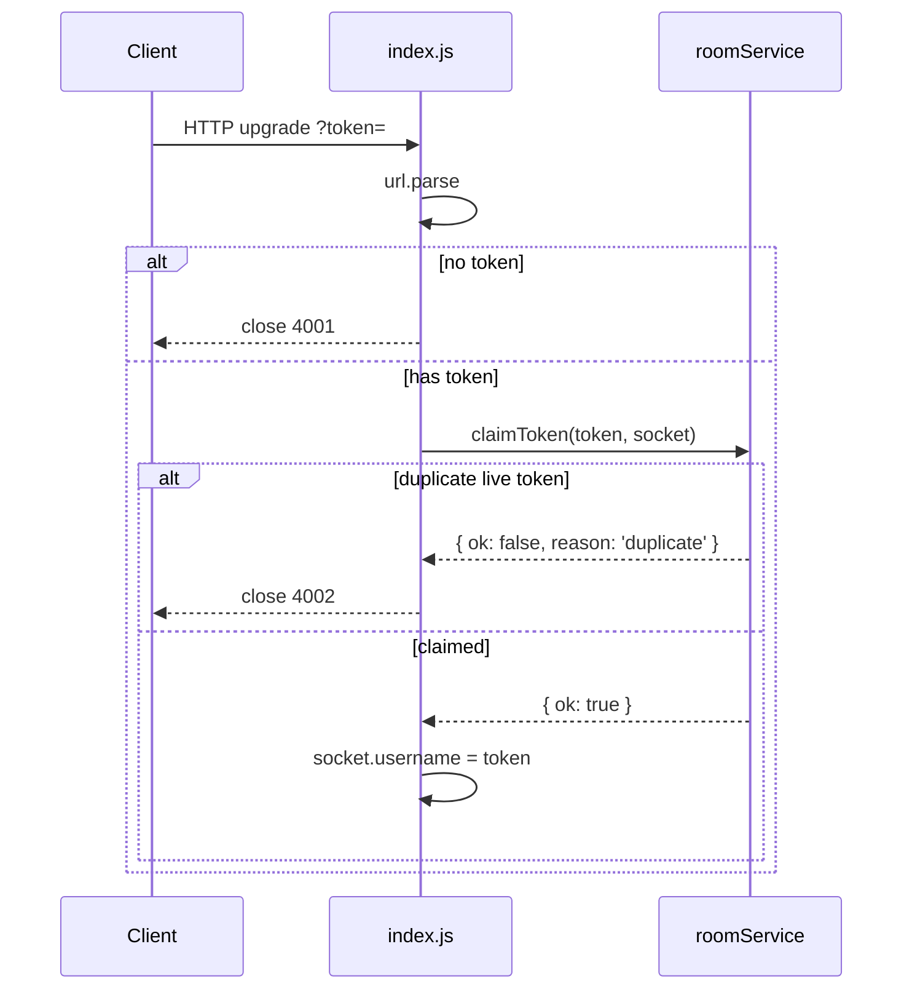
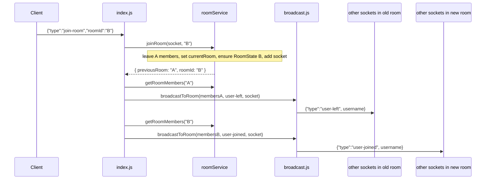
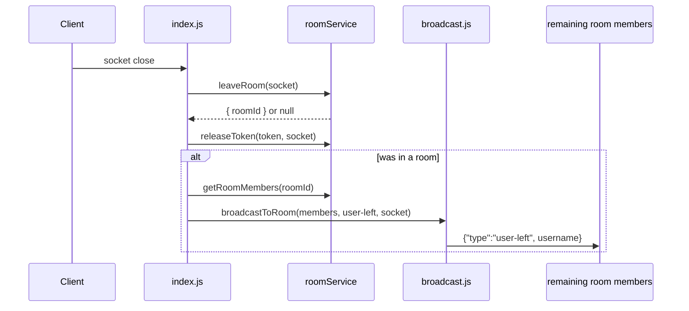

# Execution Map: Extract `roomService.js` + `broadcast.js`

Pure refactor of `server/index.js`. Behavior must not change. No PLAY / PAUSE / SEEK / SYNC. Do not touch `server/test-client.js` unless a message shape truly must change (it should not).

---

## 0. Goal

Split the raw `ws` server into three files:

```
server/
├── index.js          # WS transport only: parse messages, call roomService, call broadcast
├── roomService.js    # NEW: room/token state + logic. ZERO knowledge of WebSocket
└── broadcast.js      # NEW: broadcastToRoom, extracted as-is (takes a Set, not a roomId)
```

`index.js` keeps HTTP / WebSocket wiring. `roomService.js` owns Maps and returns plain data. `index.js` decides which payloads to send.

---

## 1. Non-goals (do not do these)

- Do not add video playback, `videoState` writes, or any new message types.
- Do not change `{ type: 'join-room' | 'user-joined' | 'user-left' }` shapes.
- Do not edit `server/test-client.js`, `server/not-index.js`, or `client/test.html`.
- Do not delete empty rooms from the `rooms` Map (current code never does).
- Do not introduce Socket.IO, Express, or extra npm packages.
- Keep CommonJS (`require` / `module.exports`) to match the existing server.

---

## 2. Current inventory (`server/index.js`)

| Concern | Where today | After |
|---|---|---|
| HTTP server + `WebSocketServer` + `PORT` | L8–18 | Stay in `index.js` |
| `rooms` Map (`roomId → Set<socket>`) | L23 | Move to `roomService.js` as `roomId → RoomState` |
| `tokenToSocket` Map | L27 | Move to `roomService.js` |
| Parse `?token=` from handshake URL | L33–34 | Stay in `index.js` |
| Close `4001` if no token | L38–43 | Stay in `index.js` |
| Duplicate-token check + `4002` | L46–50 | `claimToken` + `index.js` close |
| `socket.username` / `socket.currentRoom` | L55–56 | Still hung on the socket; `roomService` may read/write `currentRoom` |
| JSON.parse `'message'` handler | L65–75 | Stay in `index.js` |
| `join-room` leave-old-then-join | L77–96 | `joinRoom`; broadcasts stay in `index.js` |
| `'close'` room + token cleanup | L102–112 | `leaveRoom` + `releaseToken`; broadcast stays in `index.js` |
| `broadcastToRoom(roomId, payload, exclude)` | L119–129 | `broadcast.js` as `broadcastToRoom(members, payload, exclude)` |

---

## 3. Data model

### Today

```
rooms: Map<roomId, Set<socket>>
tokenToSocket: Map<token, socket>
socket.username = token
socket.currentRoom = roomId | null
```

### Target (`roomService.js` module-level state)

```
rooms: Map<roomId, RoomState>
tokenToSocket: Map<token, socket>

RoomState = { members: Set<socket>, videoState: null }
```

`videoState` is a placeholder only. Create it as `null`. Do not read, write, or broadcast it.

`getRoomMembers(roomId)` returns `rooms.get(roomId)?.members` (a `Set` or `undefined`), never the whole `RoomState`. That is how `broadcast.js` stays ignorant of the `rooms` Map.

`socket.currentRoom` stays the source of “which room is this socket in?”, same as today. `roomService` is allowed to read/write that property because it is app state on an opaque object — not WebSocket protocol.

---

## 4. Module contracts

### 4.1 `roomService.js`

Must **not**:

- `require('ws')`
- call `.send()`
- reference `.readyState` (see Decision A)
- build or send payloads such as `{ type: 'user-joined', ... }`

Must export:

| Function | Args | Return | Mirrors |
|---|---|---|---|
| `claimToken` | `(token, socket)` | `{ ok: true }` or `{ ok: false, reason: 'duplicate' }` | L46–51 |
| `releaseToken` | `(token, socket)` | `void` | L109–111 |
| `joinRoom` | `(socket, roomId)` | `{ previousRoom: string \| null, roomId: string }` | L80–92 |
| `leaveRoom` | `(socket)` | `{ roomId: string }` or `null` | L104–105 (room-removal only) |
| `getRoomMembers` | `(roomId)` | `Set<socket>` or `undefined` | `rooms.get(roomId)` today |

### 4.2 `broadcast.js`

```js
function broadcastToRoom(members, payload, excludeSocket)
```

Same loop as L119–129, except the first argument is already a `Set` (or missing):

- if `!members`, return
- `JSON.stringify(payload)` once
- for each `client` in `members`: send if `client !== excludeSocket` and `client.readyState === client.OPEN`

This file **is** allowed to use `.send()` and `.readyState`. It is transport.

### 4.3 `index.js` after

Keep:

- `createServer`, `WebSocketServer`, `url.parse`, `PORT`
- `'connection'` handler
- JSON.parse / bad-message logging
- `socket.close(4001 / 4002, ...)`
- constructing `{ type: 'user-joined' \| 'user-left', username }`
- `socket.username = token`

Replace every direct `rooms` / `tokenToSocket` mutation with a `roomService` call, then broadcast from the returned data.

---

## 5. Decisions (resolve before typing)

### Decision A — `claimToken` vs `.readyState`

Current check (L46–50):

```js
const existing = tokenToSocket.get(token);
if (existing && existing.readyState === existing.OPEN) {
    socket.close(4002, 'token already connected');
    return;
}
tokenToSocket.set(token, socket);
```

The task asks `claimToken` to mirror that check **and** forbids `.readyState` inside `roomService.js`.

**Chosen approach (preserve behavior, keep the published return type):** put the occupancy + liveness test inside `claimToken`, but do **not** `require('ws')`. Read `existing.readyState === existing.OPEN` on the opaque socket object that was passed in. Document this as the one protocol leak in `roomService` — required so `{ ok: false, reason: 'duplicate' }` still means “live duplicate”, matching today:

- live duplicate → reject
- mapped but already-closed socket → overwrite (allows reconnect before `'close'` cleanup)

Do **not** widen the return type with an `existing` field. Do **not** skip the OPEN check (that would reject reconnects while a zombie mapping remains).

If a later pass wants a strict zero-WS `roomService`, move liveness into `index.js` then. Not this task.

### Decision B — `joinRoom` return value

`previousRoom` is non-null **only** when the socket actually left a *different* room (`socket.currentRoom && socket.currentRoom !== roomId`).

Re-joining the **same** room must still:

- not emit `user-left`
- still emit `user-joined` (today re-`.add`s and broadcasts every time)

### Decision C — `'close'` order

Today: remove from room → broadcast `user-left` → free token.

Task order: `leaveRoom` → `releaseToken` → broadcast `user-left` from the returned `roomId`.

Follow the task order. Observable messages are the same because the socket is already removed from the `Set` before broadcast (same as today). Token and room Maps do not depend on each other.

### Decision D — empty rooms

Leave empty `RoomState` entries in `rooms`. Do not `rooms.delete(roomId)` when `members.size === 0`.

---

## 6. Execution order (do in this sequence)

### Step 1 — Add `server/roomService.js`

1. Create module-level `rooms` and `tokenToSocket` Maps.
2. Implement the five exports against the current `index.js` logic, with `RoomState` wrapping the Set.
3. No WS imports, no `.send()`, no payload objects.

Function bodies (behavioral spec, not extra features):

**`claimToken(token, socket)`**

```
existing = tokenToSocket.get(token)
if existing && existing.readyState === existing.OPEN
    return { ok: false, reason: 'duplicate' }
tokenToSocket.set(token, socket)
return { ok: true }
```

**`releaseToken(token, socket)`**

```
if tokenToSocket.get(token) === socket
    tokenToSocket.delete(token)
```

**`joinRoom(socket, roomId)`**

```
previousRoom = null
if socket.currentRoom && socket.currentRoom !== roomId
    rooms.get(socket.currentRoom)?.members.delete(socket)   // today: rooms.get(...)?.delete(socket)
    previousRoom = socket.currentRoom

socket.currentRoom = roomId

if !rooms.has(roomId)
    rooms.set(roomId, { members: new Set(), videoState: null })

rooms.get(roomId).members.add(socket)
return { previousRoom, roomId }
```

**`leaveRoom(socket)`**

```
if !socket.currentRoom
    return null
roomId = socket.currentRoom
rooms.get(roomId)?.members.delete(socket)
return { roomId }
```

Do not set `socket.currentRoom = null` unless you must — today the `'close'` handler does not.

**`getRoomMembers(roomId)`**

```
return rooms.get(roomId)?.members    // Set | undefined
```

### Step 2 — Add `server/broadcast.js`

Move L119–129. Change signature from `roomId` to `members`. Export `broadcastToRoom`.

### Step 3 — Rewrite `server/index.js` as transport

Require the two new modules. Delete local `rooms`, `tokenToSocket`, and the old `broadcastToRoom`.

#### Connection

```
parse token from request.url          # unchanged
if !token → close(4001, 'no token provided'); return

result = roomService.claimToken(token, socket)
if !result.ok → close(4002, 'token already connected'); return

socket.username = token
socket.currentRoom = null             # unchanged
```

#### `join-room` message

```
{ previousRoom, roomId } = roomService.joinRoom(socket, data.roomId)

if previousRoom
    broadcastToRoom(
        roomService.getRoomMembers(previousRoom),
        { type: 'user-left', username: socket.username },
        socket
    )

log `user joined room: ${roomId}`     # keep existing log

broadcastToRoom(
    roomService.getRoomMembers(roomId),
    { type: 'user-joined', username: socket.username },
    socket
)
```

State changes happen inside `joinRoom` *before* either broadcast. That is a call-order change vs today (today broadcasts `user-left` before adding to the new room), but both rooms are distinct so clients cannot observe a difference.

#### `close`

```
log `user disconnected`               # keep existing log

left = roomService.leaveRoom(socket)
roomService.releaseToken(token, socket)

if left
    broadcastToRoom(
        roomService.getRoomMembers(left.roomId),
        { type: 'user-left', username: socket.username },
        socket
    )
```

---

## 7. Call-sequence diagrams

### Connect (happy path vs duplicate)



### Join room (switch rooms)



### Disconnect



---

## 8. Behavior invariants (must still hold)

1. Missing token → close `4001` `'no token provided'`. `onopen` never fires on the client.
2. Second live connection with the same token → close `4002` `'token already connected'`. First connection stays up.
3. After a real disconnect, the same token can connect again (`releaseToken` freed it).
4. `join-room` with a new `roomId` → peers in the old room get `user-left`; peers in the new room get `user-joined`. The joining socket itself is excluded from both broadcasts.
5. `join-room` with the **same** `roomId` again → no `user-left`; `user-joined` still broadcasts to everyone else.
6. First joiner of a room creates the room; they do not receive their own `user-joined`.
7. Disconnect while in a room → remaining members get `user-left`.
8. Disconnect with no room → no broadcast, token still released.
9. Invalid JSON → log `'bad message, not JSON:'` and ignore; connection stays open.
10. Unknown `data.type` → ignore (no default handler today).
11. Message payloads stay `{ type, username }` for join/left. No extra fields.

---

## 9. What each file is *not* allowed to know

```
index.js        knows: HTTP, ws, URL, JSON, close codes, payload shapes
roomService.js  knows: Maps, RoomState, token occupancy, membership
broadcast.js    knows: Set iteration, JSON.stringify, socket.send, readyState
```

`roomService` never builds `{ type: 'user-joined' }`.
`broadcast` never looks up a room by id.
`index.js` never mutates the Maps directly.

---

## 10. Verification (mandatory, last)

Do not declare the refactor done without this.

### 10.1 Boot

```bash
cd server
node index.js
```

Expect: `Server running on port 3000`

If `npm run dev` (nodemon) is already running, restart it so it picks up the new files.

### 10.2 Two clients, same room

Terminal A:

```bash
cd server
node test-client.js alice lobby
```

Terminal B:

```bash
cd server
node test-client.js bob lobby
```

Expect:

- A: `alice connected to room lobby`
- B: `bob connected to room lobby`
- A then receives: `{ type: 'user-joined', username: 'bob' }`
- B does **not** receive its own `user-joined`

Ctrl+C terminal B (bob disconnects). Expect on A:

- `{ type: 'user-left', username: 'bob' }`

### 10.3 Duplicate token

With alice still connected:

```bash
node test-client.js alice other-room
```

Expect: that process logs a disconnect with code `4002` and reason `token already connected`. Original alice stays in `lobby`.

### 10.4 Switch rooms (optional but cheap)

Third client `carol` joins `lobby`, then (if you only have the one-shot test client) restart carol against a different room — or use two browsers on `client/test.html`. Peers in `lobby` must see `user-left` for carol.

### 10.5 If this environment cannot run two clients

Say so explicitly and hand back:

1. `cd server && node index.js`
2. In another terminal: `node test-client.js alice lobby`
3. In a third terminal: `node test-client.js bob lobby`
4. Confirm alice logs `user-joined` for bob; then kill bob and confirm alice logs `user-left`

---

## 11. Done checklist

- [ ] `server/roomService.js` exists with the five exports and two Maps
- [ ] `RoomState` is `{ members: Set, videoState: null }`; `videoState` unused
- [ ] `server/broadcast.js` takes a `Set`, not a `roomId`
- [ ] `server/index.js` has no `rooms` / `tokenToSocket` Maps and no local `broadcastToRoom`
- [ ] `index.js` still owns `4001` / `4002`, JSON parse, and payload construction
- [ ] `test-client.js` untouched
- [ ] No PLAY / PAUSE / SEEK / SYNC
- [ ] Two-client join/leave verified (or verification commands written down)

After this lands and is tested, a later task can fill in `videoState`. Not this one.
