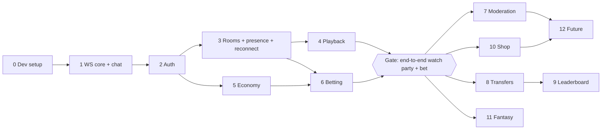

# Watch-party platform — build phases

This document defines **what** each phase delivers and **when it's done**. The step-by-step tasks are in [`watchparty_execution_plan.md`](./watchparty_execution_plan.md). The design itself (rules, schema, protocol, file tree) is in [`watchparty_app_project-structure.md`](./watchparty_app_project-structure.md). If anything here disagrees with that document, the structure document wins, and this one should be fixed.

## Overview

| Phase | Steps | Outcome |
|---|---|---|
| 1. Core MVP | 0 Dev setup · 1 WebSocket core and chat · 2 Auth · 3 Rooms, presence, reconnect · 4 Playback | Verified users watch a synced YouTube or Twitch video together and chat |
| 2. Centerpiece | 5 Economy · 6 Betting windows | Users get points, bet on admin-run windows, and are paid by the house |
| 3. Operations | 7 Moderation, reports, flags | The admin can keep the room safe and review abuse flags |
| 4. Expansion | 8 Transfers · 9 Leaderboard · 10 Shop · 11 Fantasy | Social and long-term features around the economy |
| 5. Future | 12 Dice, horse racing, cosmetics, EXTERNAL windows, more abuse signals | Games and cosmetics on top of the existing seams |

**Gate rule:** nothing past phase 2 is started until a watch party and a betting window work end to end, with real accounts, on a fresh database.

Steps 4 (playback) and 5 (economy) don't depend on each other and can be built in either order after step 3.

## Standards that apply to every step

### Definition of done

A step is done when all of these are true:

1. Every exit criterion listed for the step passes.
2. `npm run lint` and `npm run typecheck` pass with no errors, and `npm test` passes.
3. New server behaviour has tests. Economy, betting and anything with locking are tested against the real Postgres test database, never mocks.
4. Every message the step adds is in `shared/src/messages/` with a zod schema in `shared/src/schemas/`. The client and server both import it from there.
5. Every error the step can return has a code in `shared/src/errors.ts`, and replies echo the `requestId`.
6. Every limit the step introduces is in `shared/src/limits.ts`.
7. The demo scenario for the step runs from a fresh database (`npm run db:reset && npm run db:seed`).
8. The structure document is updated if the implementation had to change a rule, a column or a message. Code and doc don't drift.

### Conventions

- **One branch per step:** `step-<n>-<name>`, for example `step-1-ws-core`, merged when the definition of done holds.
- **Commits:** small, one concern each, present tense ("Add ticket redemption").
- **Migrations:** one Prisma migration per schema change, named after what it adds. Raw SQL goes in its own migration (partial indexes, `lower(...)` unique indexes).
- **No feature logic in `ws/`.** If a change to `ws/` is needed for a feature, it's a change to the core and has to work for every feature.
- **Points move only through `economy/ledger.ts`**, from step 5 onwards.
- **Names render only through `<Nickname>`**, from step 2 onwards.

### Test layers

| Layer | Tool | Used for |
|---|---|---|
| Unit | Vitest | Pure functions: odds, payouts, schemas, ring buffer, countdown helpers |
| Integration (DB) | Vitest + test Postgres | Ledger, locks, constraints, auth flows, settlement, void |
| Integration (WebSocket) | Vitest + real `ws` clients against a server on a random port | Upgrade, dispatch, snapshot ordering, broadcasts, reconnect |
| Concurrency | Vitest, parallel promises | Bets racing auto-lock, crossing transfers, double settle, sign-up collisions |
| Manual demo | Browser + Mailpit | The demo scenario at the end of each step |

---

## Phase 1: core MVP

**Goal:** verified users watch the same video in a room the admin created, and chat live.

### Step 0: Dev setup

**Purpose:** a workspace where the client, server and shared code build, lint, test and run with one command each.

**Scope**
- Root npm workspaces: `client`, `server`, `shared`.
- `tsconfig.base.json` in strict mode; each workspace extends it.
- `docker-compose.yml`: Postgres 16 (dev and test databases) and Mailpit.
- `server/`: TypeScript, `tsx` for dev, Prisma initialised, `config.ts` validating `.env` with zod, Vitest. The old Express, Socket.IO and nodemon dependencies are removed.
- `client/`: Vite + React + TypeScript, React Router, Zustand, dev proxy for `/auth`, `/health` and `/ws`.
- `shared/`: package `@watchparty/shared`, consumed as TypeScript source by both sides.
- ESLint + Prettier across all workspaces.
- Theme tokens (colours and fonts from the theme sample) as CSS variables.
- Root scripts: `dev`, `build`, `test`, `lint`, `typecheck`, `db:up`, `db:migrate`, `db:reset`, `db:seed`.
- README rewritten for the new setup.

**Out of scope:** any feature code, any database tables.

**Deliverables:** the files listed under step 0 in the execution plan.

**Exit criteria**
- `npm install` at the root installs every workspace.
- `npm run db:up` starts Postgres and Mailpit; Mailpit's UI loads on `http://localhost:8025`.
- `npm run dev` starts the server on `:3000` (responds to `GET /health`) and the client on `:5173` (renders a placeholder page in the theme fonts and colours).
- The client can call `/health` through the Vite proxy.
- `npm test` runs one server test and one shared test, both passing, with the server test connecting to the test database.
- `npm run lint` and `npm run typecheck` pass.
- `server/package.json` no longer lists `express`, `socket.io` or `nodemon`.

**Risks:** Windows path and line-ending issues (set `.gitattributes` and Prettier `endOfLine: lf`); Docker Desktop not running.

### Step 1: WebSocket core and chat

**Purpose:** the reusable WebSocket core, proven by chat as the first registered feature.

**Scope**
- `ws/`: upgrade (Origin check, temporary dev identity), connection (heartbeat, cleanup), dispatch (parse → rate-limit → validate → registry), feature registry with duplicate-action check, snapshot assembly, rooms map, broadcast.
- Every client message is `{ action, requestId, payload }`; every reply echoes `requestId`; errors use `{ type: "error", requestId, code, message }`.
- `room:join` adds the socket to the room first, then builds the snapshot.
- Chat feature: `chat:send`, a 100-message ring buffer per room with a room `seq`, 300-character limit, 5 messages per 5 seconds.
- Client: `socket.ts` (connect, reconnect with backoff, typed `send`/`on`, request matching), a bare room page with the chat panel.

**Temporary dev identity:** in development only, the upgrade accepts `?dev=<name>` instead of a ticket. It's removed in step 2; a test asserts it's rejected when `NODE_ENV` isn't `development`.

**Out of scope:** accounts, rooms in the database (any room id is accepted in this step), chat event kinds other than `user` and `system`.

**Exit criteria**
- Two browser tabs with different dev names join the same room and see each other's messages instantly; a third tab in another room doesn't.
- A tab that joins late receives the last 100 messages in its snapshot, in `seq` order, with no duplicates or gaps against live messages.
- Malformed JSON, unknown actions and invalid payloads get an `error` reply with the right code and the original `requestId`; the socket stays open.
- The 6th message in 5 seconds gets `RATE_LIMITED`.
- A message over 16 KB closes the socket (`maxPayload`).
- A socket that stops answering pings is dropped after two missed pongs.
- Starting the server with two features that register the same action fails at startup.
- The client reconnects automatically after the server restarts.

**Tests:** dispatch validation paths, duplicate action detection, snapshot ordering (message sent during join is neither lost nor duplicated), rate limit, ring buffer wraparound, heartbeat drop.

### Step 2: Auth

**Purpose:** real accounts replace the dev identity. Only verified users can open a socket.

**Scope**
- Schema: `User` (without `balance`, which arrives in step 5), `Session`, `EmailToken`, `AuthEvent`, `SignupClaim`, `Flag`, `NicknameChange`, plus case-insensitive unique indexes on `loginId` and `nickname`.
- HTTP router on the built-in `http` module: JSON body parsing with a size cap, cookies, Origin check on every state-changing request, per-IP and per-account rate limits.
- Sign-up with three availability checks, the 1-second collision rule and `formToken` replay.
- Email verification through Mailpit, the verify-email gate, resend, change email, and the 24-hour unverified-account cleanup.
- Login with cookie sessions (30-day sliding), logout, password reset (deletes all sessions), find ID.
- `AuthEvent` recording with client IP (IPv6 as /64); shared-IP flag at sign-up; Tor exit list block at sign-up, login and ticket.
- `/auth/ws-ticket`: session + verified email → single-use 30-second ticket; the upgrade redeems it atomically. The dev identity is removed.
- Admin seed (`prisma/seed.ts`) creating the "Admin" account from `.env`.
- Profiles feature: room snapshot includes display profiles; `<Nickname>`; `admin:rename_user` with `NicknameChange` logging and `user:profile_updated`.
- Client pages: Register, Verify gate, Verify email landing, Login, Logout, Find ID, Reset password.

**Out of scope:** points (no grant until step 5), rooms in the database.

**Exit criteria**
- A new user signs up (all three checks green), receives the email in Mailpit, verifies, logs in and chats. Their nickname renders through `<Nickname>`.
- Sign-up is blocked with the right top-of-page message when a field is unchecked or failed; editing a field resets its check.
- Two sign-ups sharing a value less than 1 second apart both fail with `F'mglw'nafl throd n'gha`; 1 second or more apart, the first succeeds and the second gets "already taken".
- "Kaz" and "kaz" are the same login ID and nickname; "Admin" in any case is refused as a nickname; "AAdmin" is allowed.
- An unverified user can log in but only reaches the verify gate; `/auth/ws-ticket` returns `EMAIL_NOT_VERIFIED`. After 24 hours (tested with a shifted clock) the account is deleted and its values are free again.
- Changing the email invalidates the old link; resend is limited to once a minute.
- Password reset logs out every existing session; find ID and reset reply generically for unknown emails.
- A ticket works once, within 30 seconds; a replayed or expired ticket is refused. A request from a disallowed Origin is refused.
- A Tor exit IP (from a fixture list) is refused at sign-up, login and ticket.
- The admin renames a user; every open client, and old chat messages, show the new name. The rename is logged.
- The dev identity no longer works.

**Tests:** availability rules, collision timing (both fail; first wins), `formToken` replay, verification and grant-free state, session sliding and expiry, ticket single use, Origin check, cleanup job, rename propagation.

### Step 3: Rooms, presence and reconnect

**Purpose:** rooms are real, created by the admin, and a client that reconnects ends up in exactly the right state.

**Scope**
- Schema: `Room` with all playback columns (used from step 4).
- `room:create` / `room:update` (admin only); `room:list` for everyone, sent over the socket before joining; `room:join` checks the room exists.
- `room:presence { watching }`: unique users per room, sent on join and leave, at most once every 2 seconds.
- Reconnect: on reconnect the client fetches a new ticket, rejoins the last room, applies the snapshot, and drops any event older than what it holds (chat `seq`, later `playbackVersion`, `window.version`, `ledgerTxId`).
- Client: room list, room page layout (player area, rail, chat), admin "Rooms & playback" page (create room part only).

**Exit criteria**
- Only the admin can create or edit a room; a user attempt gets `FORBIDDEN`.
- Joining a room that doesn't exist gets `NOT_FOUND`.
- The watching count counts two tabs of the same user once and updates within 2 seconds of a join or leave.
- Killing and restarting the server while clients are connected: every client reconnects, rejoins its room and shows chat without duplicates or gaps (up to the 100-message buffer, which is lost on restart by design).

**Tests:** admin checks, presence counting and throttling, reconnect snapshot versus live-event ordering.

### Step 4: Playback

**Purpose:** everyone in a room watches the same thing, controlled by the admin.

**Scope**
- `playback:load/play/pause/seek` (admin only), stored on `Room` with `playbackVersion`; `playback:state` broadcast; playback state in the room snapshot.
- Client player with adapters: YouTube IFrame API first, then Twitch embed (with `parent` from `TWITCH_PARENT_DOMAINS`).
- VOD sync: expected position = `positionSec + (serverNow − positionUpdatedAt)` while playing; check every 3 seconds; seek if more than 1.5 seconds off. Live: no position sync.
- Server clock offset on the client (`server-clock.ts`).
- Admin playback controls (play for everyone, ±10 s, load a different video); "In sync with Admin" and source badges.

**Exit criteria**
- Admin loads a YouTube VOD; two users' players start within 1.5 seconds of each other and of the admin, and stay there after pause, seek and resume.
- A user who joins mid-video lands at the right position.
- A stale `playback:state` (lower version) is ignored.
- A Twitch live channel plays for everyone without position sync; a Twitch VOD syncs like YouTube.
- A non-admin `playback:*` gets `FORBIDDEN`.

**Tests:** version ordering, expected-position calculation, admin checks. Player adapters are tested manually.

### Phase 1 exit

A verified user opens the site, joins the admin's room, watches a synced video and chats. The admin controls playback. A server restart doesn't leave anyone in a broken state.

---

## Phase 2: centerpiece

**Goal:** the betting loop works end to end: points in, bets placed live, the house pays winners, voids refund everything.

### Step 5: Economy

**Purpose:** a double-entry ledger that every later feature moves points through.

**Scope**
- Schema: `User.balance`, `LedgerTx`, `LedgerEntry`, `DailyUse`.
- `ledger.ts`: post a transaction whose entries sum to 0; checked debit (`balance >= amount`); forced debit (double-down penalty only); unique `(reason, refId)` for idempotency.
- Lock order helper: window row (when present), then user rows sorted by id, then ledger inserts. Transaction helper with a 15-second timeout and retry on `40P01` / `40001`.
- Accounts: `USER:<id>` (cached balance), `HOUSE`, `ESCROW:<ref>`, `SHOP` (computed from entries).
- Sign-up grant: 5,000 `HOUSE → USER` on first verification (hooked into step 2's verify flow).
- Daily lucky box: `DailyUse` `LUCKY_BOX` per Tokyo day, `crypto.randomInt(10, 10001)`, `HOUSE → USER`. Header chip and pop-up.
- `balance:updated` with `ledgerTxId`; balance in the snapshot.
- `scripts/reconcile.ts`, also run at the end of the test suite.

**Exit criteria**
- Verifying an email grants exactly 5,000 once, even if the link is opened twice.
- The lucky box pays once per Tokyo day between 10 and 10,000; a second open the same day is refused; it works when the balance is negative.
- Crossing debits between two users in parallel never deadlock (or recover through retry) and never leave a balance wrong.
- A checked debit that would go below 0 fails and rolls back the whole transaction.
- `reconcile.ts` reports every cached balance equal to its ledger sum.
- The balance in the header updates live and never moves backwards on reconnect.

**Tests:** ledger sum-to-zero, idempotent `(reason, refId)`, checked versus forced debit, lock order under parallel load, Tokyo day boundary for the lucky box, reconciliation.

### Step 6: Betting windows

**Purpose:** the feature the app is built around.

**Scope**
- Schema: `BettingWindow`, `WindowOption`, `Bet`, `PendingDoubleDown`; raw SQL partial unique index for one `OPEN` window per room.
- Admin: open (question, options with label, code and colour, duration presets or custom 10 s–10 min, min and max stake, double down allowed), lock now, extend +30 s, settle (pick the winner), void; windows list; stale-window marker (`lockedAt` older than 24 h); stats (double-downs used today, points in escrow).
- Auto-lock: per-window timer plus a 10-second sweeper; timers rebuilt from the database on startup.
- `bet:place`: under the window row lock; `OPEN` and `now() < closesAt` by the database clock; option belongs to the window; checked debit `USER → ESCROW`; double down claims `DailyUse` and `PendingDoubleDown`; duplicate `requestId` replays the original result; the admin can't bet on `ADMIN` windows.
- Live: `bet:placed` feed, double-down chat event (structured, rendered with `<Nickname>`), `window:odds` at most once per second, window chat announcement; snapshot with the window, options, totals, the newest 50 bets and the user's own bet.
- Settle: resolver must match `resolution`; all stakes `ESCROW → HOUSE`; each winner paid `floor(stake × m × pool ÷ winningPool)` by `HOUSE`; doubled losers' penalty by forced debit; no winning bets → void path.
- Void (no winners, admin cancel while `OPEN`, admin void while `LOCKED`; no reason needed): every stake refunded, no penalty, double-down tickets returned.
- Client: collapsed bar and expanded card in every state, stake chips, double-down toggle with the below-zero warning, estimated return, submitted bet, result banner (net profit or loss), team totals, live bet feed, admin betting page with the confirmation dialogs, using the copy from "Result copy".

**Exit criteria**
- Only one window can be `OPEN` per room, even with two admin requests at once.
- 20 bets racing the auto-lock: every bet is either accepted before `closesAt` or refused with `WINDOW_CLOSED`; none is accepted after.
- The same `requestId` sent twice creates one bet and replies `replayed: true` the second time.
- The worked examples hold: 5,000 on 2.98x doubled wins 29,800 (net +24,800); balance 6,000, 5,000 doubled and lost, ends at −4,000.
- A second double-down the same day, or while another is unresolved, is refused.
- Settling twice pays once. Settling with a winner from another window is refused.
- A window with no bets on the winner is voided: every stake is refunded and every double-down ticket returned.
- After every settle and void, escrow for the window is 0 and `reconcile.ts` passes.
- A viewer who joins mid-window sees the same feed and totals as everyone else.
- The admin gets `ADMIN_CANNOT_BET` on an `ADMIN` window.

**Tests:** all of the above as automated tests, plus odds and payout rounding, transition table (every illegal transition refused), timer rebuild after restart.

### Phase 2 exit (the gate)

On a fresh database: two users sign up and verify (5,000 each), open their lucky boxes, join the admin's room and watch a synced video. The admin opens a window; both bet (one doubled), see each other's bets live, and the window auto-locks. The admin settles; the winner is paid by the house; the result banners show the right net amounts. A second window is voided; both are refunded and the double-down ticket comes back. `reconcile.ts` passes.

---

## Phase 3: operations

**Goal:** the admin can deal with bad behaviour and review what the abuse signals flagged.

### Step 7: Moderation, reports and flags

**Scope**
- Schema: `ModerationAction`, `Report`.
- `mod:mute` (muted users can't chat until `until`), `mod:kick` (closes the user's sockets), `mod:ban` (deletes sessions, closes sockets, blocks login and tickets).
- `report:create` with an evidence snapshot of the message (text, time, room).
- Admin: users page (IP history, accounts sharing an IP, balance, rename), flags queue (dismiss / actioned), reports queue, moderation log.

**Exit criteria**
- A muted user's `chat:send` is refused until the mute ends.
- A banned user is disconnected within a second, can't log in, and can't get a ticket; unbanning restores access.
- A report keeps the message text even after the chat buffer is gone (server restart).
- Every moderation action is logged with the admin and reason.

---

## Phase 4: expansion

Each step starts with a short design review of the rules still open in the structure document.

| Step | Scope | Exit criteria |
|---|---|---|
| 8. Transfers | `wallet:transfer`, checked debit (sender can't go below 0), replay, rate limit, admin transfers log, `NEW_ACCOUNT_TRANSFER` flag; Wallet page (balance, history, transfer dialog); lucky box moves into the Wallet page | Crossing transfers in parallel never deadlock; a negative receiver can be bailed out; replays don't double-send |
| 9. Leaderboard | Ranking by balance, negative balances included | Matches the ledger; updates without a page reload |
| 10. Shop | `ShopItem` / `Inventory`, purchases `USER → SHOP` | A purchase is one ledger transaction; buying below 0 is refused |
| 11. Fantasy | Rules to be designed first | Defined by that design |

## Phase 5: future

Chat commands and dice (committed-seed RNG), horse racing (extract `rounds/` from betting), cosmetics (`Item` / `Equipped`, rendered by `<Nickname>`), `EXTERNAL` windows (OpenDota sync), VPN and fingerprint signals. Each is designed in the structure document before it's scheduled.
